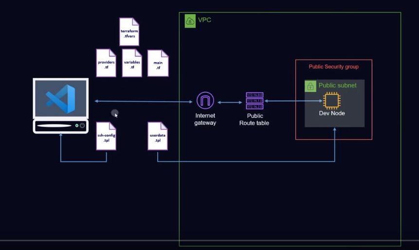

<p>
  
  
</p>

<h1 align="center">Terraform Freecodecamp AWS </h1>

### Projeto terraform para provisionar infraestrutura na AWS criando os seguintes recursos:

## 1 - Iniciar projeto.

```sh
terraform init
```

## 2 - Criar arquivo terraform.tfvars na raiz do projeto com as seguintes variaveis.

```sh
key_name = Nome da chave dentro da AWS
key_file_name = Nome do arquivo da chave publica que será enviada
```

## 3 - Executar projeto

```sh
yarn dev
```

## Autor

👤 **Marcus Vinicius**

- Github: [@marcusjava](https://github.com/marcusjava)

## Show your support
